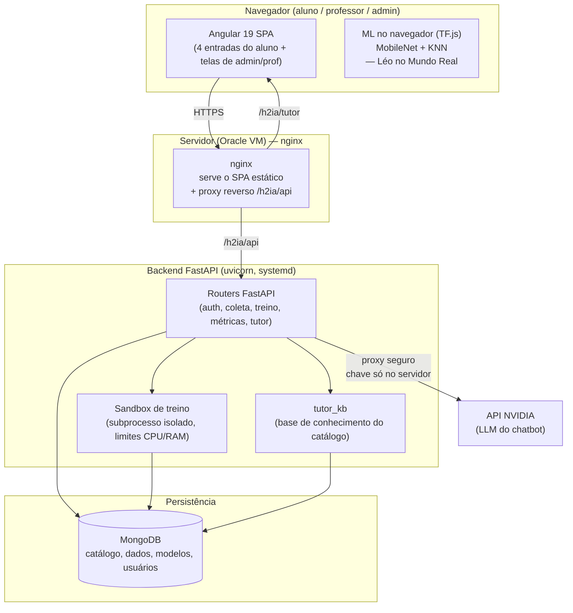
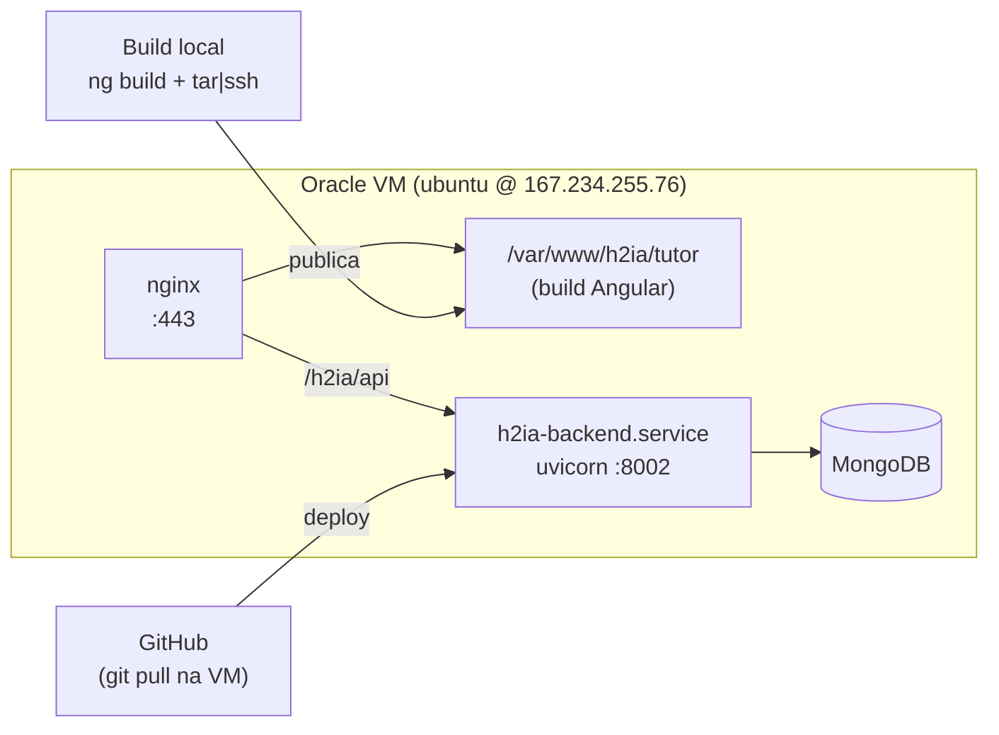
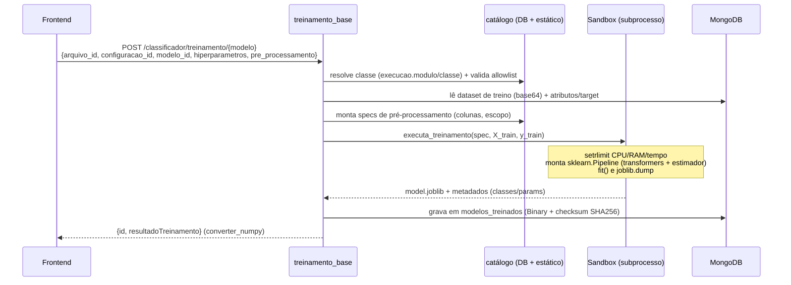
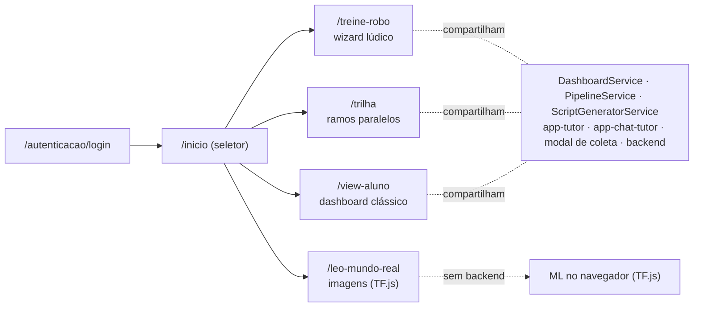
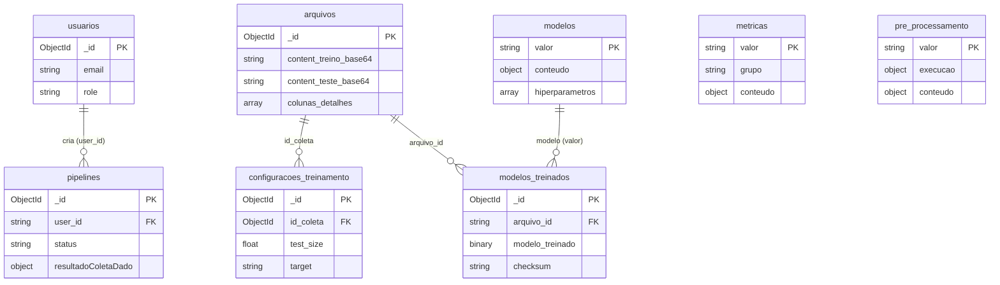
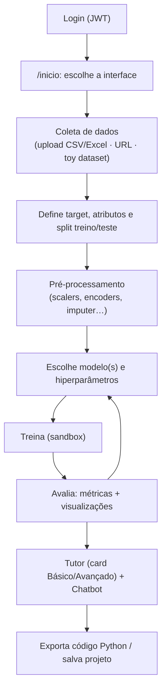
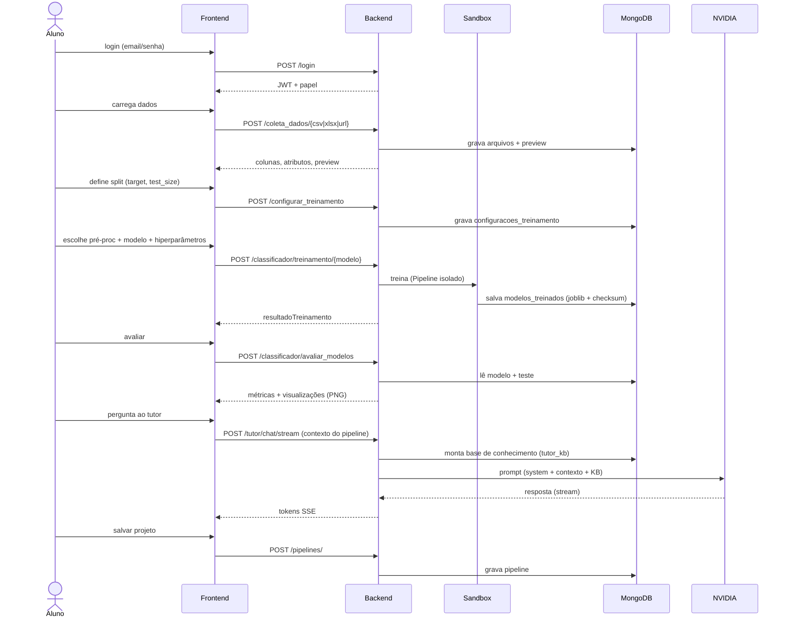

# Documentação do Projeto Iana / H2IA Tutor

Plataforma educacional para ensinar **Machine Learning** de forma interativa, com público-alvo de
**ensino fundamental e médio**. O aluno monta um pipeline de ML (dados → pré-processamento → modelo →
métricas), treina modelos de verdade (scikit-learn no servidor), vê as métricas e visualizações, e conta
com um tutor (cards didáticos + chatbot com LLM) durante todo o caminho.

> Os diagramas abaixo usam Mermaid e renderizam direto no GitHub.

## Sumário
1. [Visão geral](#1-visão-geral)
2. [Arquitetura de software](#2-arquitetura-de-software)
3. [Backend (FastAPI)](#3-backend-fastapi)
4. [Frontend (Angular)](#4-frontend-angular)
5. [Esquema do banco de dados](#5-esquema-do-banco-de-dados)
6. [Fluxo de uso da ferramenta](#6-fluxo-de-uso-da-ferramenta)
7. [Segurança](#7-segurança)
8. [Infraestrutura e deploy](#8-infraestrutura-e-deploy)
9. [Apêndices](#9-apêndices)

---

## 1. Visão geral

| Componente | Tecnologia | Repositório |
|---|---|---|
| Frontend | Angular 19, Angular Material, RxJS, SCSS | `IanaMary/ensinado-aprendizado-maquina` |
| Backend | FastAPI, Motor (MongoDB async), Pydantic, scikit-learn, Yellowbrick, MLflow | `IanaMary/ensinado-aprendizado-maquina-back` |
| Banco | MongoDB | — |
| LLM (chatbot) | API NVIDIA (OpenAI-compatible) | externo |
| Base de conhecimento | Markdown/JSON didático | `base_de_conhecimento/` |

**Produção (Oracle Cloud):** frontend em `https://absapt.tk/h2ia/tutor/`, API em `https://absapt.tk/h2ia/api/`.

O aluno tem **quatro entradas** (escolhidas no seletor `/inicio` após o login):
- **Dashboard clássico** (`/view-aluno`) — editor de pipeline tradicional;
- **Trilha** (`/trilha`) — visualização em trilha com **ramos paralelos** (compara vários modelos ao mesmo tempo);
- **Treine seu Robô** (`/treine-robo`) — wizard lúdico (classificação/regressão/agrupamento) com treino real no backend, modo "🔮 adivinha" e "🎲 Desafiar o Léo" (criança × robô);
- **Léo no Mundo Real** (`/leo-mundo-real`) — classificação de **imagens** com fotos do aluno, rodando **100% no navegador** (TF.js: MobileNet + KNN); não usa o backend.

---

## 2. Arquitetura de software

### 2.1 Componentes

### 2.2 Camadas

- **Apresentação (Angular):** componentes + serviços com estado em `BehaviorSubject`. Rotas lazy-loaded, protegidas por `AuthGuard` (papel do JWT).
- **API (FastAPI):** routers temáticos; quase todos exigem JWT. Catálogo **data-driven** (modelos/métricas/pré-processamento são lidos do banco).
- **Execução (sandbox):** o treino roda em **subprocesso isolado** com limites de CPU/RAM/tempo e uma _allowlist_ de módulos Python.
- **Persistência (MongoDB):** catálogo, datasets enviados, configurações, modelos treinados (binário joblib), pipelines salvos, usuários, histórico de chat.
- **Serviços externos:** API da NVIDIA para o LLM do chatbot (a chave nunca chega ao frontend).
- **ML no navegador (sem backend):** o "Léo no Mundo Real" faz **transfer learning client-side** com TF.js (MobileNet + KNN, backend WebGPU com fallback WebGL/CPU). As fotos do aluno **não saem do navegador**.

### 2.3 Deploy

> Existe também um ambiente **Docker** completo (branch `docker-compose-teste`): `mongo` + `backend` + `frontend` em containers, com o nginx do front fazendo proxy de `/api/` para o backend. Ver `DOCKER.md`.

---

## 3. Backend (FastAPI)

### 3.1 Montagem (`app/main.py`)
- **CORS** configurável por `ALLOWED_ORIGINS`.
- **Routers públicos:** `login` (`POST /login`), `toy_datasets`, `convite`.
- **Routers protegidos** (dependência global `Depends(get_usuario_atual)`): `usuarios`, `conf_pipeline`, `tutor`, `chat_tutor`, `artefatos`, `pipelines`, `admin`, coleta de dados (`/coleta_dados/*`), configuração de treino (`/configurar_treinamento`), os ~24 routers de modelo em `/classificador/treinamento/*`, o treino genérico e as métricas em `/classificador`.
- **Startup:** _prewarm_ de datasets UCI em background. **`GET /healthcheck`** testa o MongoDB.

### 3.2 Autenticação e papéis (`app/security.py`, `app/routers/login.py`)
- **JWT HS256**, segredo em `SECRET_KEY` (env). Payload `{"sub": email, "exp": ...}`.
- Login: valida senha com **bcrypt**, devolve `{access_token, token_type, usuario}`. Rate-limit de 20 req/min por IP.
- `get_usuario_atual(token)` decodifica o JWT e **carrega o documento do usuário** do Mongo (chave `_id`).
- **Papéis:** `aluno`, `professor`, `admin` (campo `role`). Alguns endpoints checam o papel (ex.: só admin troca o LLM).

### 3.3 Estrutura de pastas (`app/`)

| Pasta | Função |
|---|---|
| `routers/` | Endpoints: login, usuários, convite, pipelines, admin, coleta, e ~24 routers de modelo |
| `schemas/` | Modelos Pydantic de request/response (`DatasetRequest`, `ChatTutorRequest`, …) |
| `metricas/` | Avaliação de modelos + visualizações (Yellowbrick/sklearn → PNG) e `POST /classificador/prever` |
| `pre_processamento/` | Catálogo canônico de transformers + _allowlist_ de módulos |
| `sandbox/` | Execução isolada do treino (`runner.py` orquestra, `child.py` faz o `fit`) |
| `models/` | Modelos de domínio e geradores de datasets lúdicos |
| `funcoes_genericas/` | Utilitários (`converter_numpy`, `validar_object_id`, base64 ↔ DataFrame) |
| `coleta_dados/` | Ingestão CSV/Excel/URL (anti-SSRF) e split treino/teste |
| `modelos_custom/` | Estimadores customizados permitidos na allowlist |

### 3.4 Fluxo de treino

Pontos-chave:
- **Pipeline real:** o pré-processamento escolhido vira um `sklearn.Pipeline` (com `ColumnTransformer` quando há colunas específicas), serializado junto ao estimador — a avaliação reaplica tudo no `predict`.
- **Isolamento:** subprocesso `python -m app.sandbox.child` com `SANDBOX_MAX_RAM_MB`, `SANDBOX_MAX_CPU_SEC`, `SANDBOX_MAX_WALL_SEC`. Erros viram `SandboxError` (timeout/memory/crash → HTTP 400/500).
- **Allowlist:** só `sklearn.`, `xgboost`, `lightgbm`, `yellowbrick.`, `app.modelos_custom.` — reaplicada dentro do sandbox (defesa em profundidade).
- **JSON seguro:** `converter_numpy` converte tipos NumPy e mapeia `NaN/Inf → None`.

### 3.5 Métricas e visualizações (`app/metricas/metricas.py`)
- **`POST /classificador/avaliar_modelos`**: carrega o modelo (`joblib.load`, valida checksum), aplica no conjunto de teste e calcula as métricas conforme o tipo:
  - **Classificação:** acurácia, precisão, recall, F1, matriz de confusão.
  - **Regressão** (`is_regressor`): R², MAE, MSE/RMSE.
  - **Agrupamento** (sem `y_test`): silhueta, Calinski-Harabasz, Davies-Bouldin.
- **Visualizações** (Yellowbrick + sklearn, tema roxo, fonte DejaVu Sans) "queimadas" em **PNG base64**: matriz de confusão, relatório, erros de predição, balanceamento; silhueta/distância de clusters/cotovelo; resíduos, prediction error, distância de Cook.
- **`POST /classificador/prever`**: usa um modelo já treinado para prever uma única amostra (modo "robô adivinha").

### 3.6 Catálogo data-driven (`app/pre_processamento/catalogo.py`)
- Catálogo canônico de **10 transformers** (scalers, encoders, imputer, polynomial, power) com `{modulo, classe, hiperparametros, escopo, aplica_em}`.
- `db.pre_processamento` pode **sobrescrever/registrar** transformers via campo `execucao` (admin), validado pela allowlist.
- Modelos e métricas seguem a mesma ideia: o campo `execucao` (quando presente) diz qual classe/função instanciar; itens **novos** cadastrados pelo admin treinam e geram código sem mudança de código-fonte.

### 3.7 Tutor e chatbot
- **`app/routers/chat_tutor.py`** — proxy seguro para a NVIDIA:
  - `POST /tutor/chat` e `POST /tutor/chat/stream` (SSE). Contexto do pipeline (truncado a 8000 chars) + base de conhecimento entram no _system prompt_. Rate-limit por usuário.
  - Histórico: `GET/POST/GET{id}/PUT{id}/DELETE{id} /tutor/chat/historico`.
  - LLM configurável em `db.configuracoes_tutor` (`chave: "llm_model"`); só admin altera. Health-check dos modelos com cache (TTL 30 min).
  - A chave da NVIDIA fica **apenas** no `.env` do servidor.
- **`app/tutor_kb.py`** — lê o `conteudo` de `db.modelos`/`db.metricas` (cache TTL 10 min) e monta uma ficha compacta por item (resumo, quando usar/evitar, hiperparâmetros com defaults, fórmula, link). Injeta o **índice de todo o catálogo** + as **fichas dos itens citados no contexto** (até ~6000 chars). Defensivo: falha de banco → bloco vazio.

### 3.8 Coleta de dados
- Upload **CSV/Excel** e ingestão por **URL**. A URL passa por **anti-SSRF**: só `http(s)`, resolve o host e bloqueia IPs privados/loopback/link-local/reservados; download server-side com `follow_redirects=False`, teto de 50 MB e timeout. O resultado é igual ao do upload (preview, colunas, split).

---

## 4. Frontend (Angular)

### 4.1 Rotas e controle de acesso
- App routes (lazy): `autenticacao` (login/cadastro), `ativar-conta`, `manual`, e `''` → `InternoModule` com `canLoad: [AuthGuard]`.
- Internas (lazy): `inicio`, `treine-robo`, `leo-mundo-real`, `trilha`, `view-aluno`, `view-professor`, `view-admin`.
- **`AuthGuard`** valida o JWT e checa o papel contra `ROTAS_POR_PAPEL`:
  - `aluno → [inicio, treine-robo, leo-mundo-real, trilha, view-aluno]`
  - `professor → [view-professor]`
  - `admin → [view-admin]`
  - Papel desconhecido ou rota fora da lista → volta para o login.
- Após o login, o aluno cai no **seletor `/inicio`** (escolhe Robô / Léo no Mundo Real / Trilha / Clássico).

### 4.2 As quatro entradas do aluno

- **Clássico (`/view-aluno`)**: editor de pipeline + "meus projetos" + galeria de modelos públicos do professor.
- **Trilha (`/trilha`)**: fases (dados → split → X → y → modelo → métricas → viz) com **ramos paralelos** (vários modelos comparados ao mesmo tempo); inspetor com aba Básico (tutor) e aba Código (Python gerado).
- **Treine seu Robô (`/treine-robo`)**: mascote e wizard de 4 passos (Missão → Sentidos → Cérebro → Treinar), ciente do tipo de tarefa (classificação/regressão/agrupamento), com treino **real** no backend, datasets lúdicos (🌸 Flores, 🍦 Sorvetes, 🐶 Cachorros, 🐠 Cardume…), modo "🔮 adivinha" e **"🎲 Desafiar o Léo"** (criança × robô usando o modelo real via `/classificador/prever`).
- **Léo no Mundo Real (`/leo-mundo-real`)**: classificação de **imagens** com fotos do aluno (câmera ou galeria), **100% no navegador** — ver 4.7.

### 4.3 Serviços principais

| Serviço | Papel |
|---|---|
| `DashboardService` | Carrega catálogos (coleta, pré-proc, modelos, métricas) e chama a API; estado em `BehaviorSubject` |
| `PipelineService` | Estado do pipeline e CRUD de projetos (`/pipelines/`) — o mesmo projeto abre nas duas visões |
| `ScriptGeneratorService` | Gera o código **Python (scikit-learn)** do pipeline; exporta `.py`/`.ipynb`/bundle |
| `AuthService` | Validação do JWT, `sessionStorage`, logout |
| `SessionService` | Guarda IDs da coleta/configuração de treino na sessão |

### 4.4 Tutor e chatbot no front
- **`app-tutor`** (card didático): abas **Básico** (campo `resumo_basico`, linguagem simples + dicas) e **Avançado** (descrição técnica, fórmula, hiperparâmetros), além de conceitos, quando usar/evitar, mídia e **referências**. O conteúdo vem do campo `conteudo` no banco (catálogo), com fallback mínimo.
- **`app-chat-tutor`**: chat com **streaming SSE**, sugestões contextuais geradas a partir do item clicado e histórico persistido por pipeline.

### 4.5 Telas de admin
- **`conf-pipeline`**: 4 abas (coleta, modelos, métricas, pré-proc) para habilitar/desabilitar itens, editar o `execucao` (módulo/classe/hiperparâmetros) e o `conteudo` didático.
- **`conf-tutor`**: edita o HTML genérico do tutor por etapa e configura o **LLM** do chatbot (com health-check).

### 4.6 Ambientes
- `environment.ts` (dev): `apiUrl: 'http://127.0.0.1:8000/'`.
- `environment.prod.ts`: `apiUrl: '/h2ia/api/'` (atrás do nginx).
- `environment.docker.ts` (branch docker): `apiUrl: '/api/'`.

### 4.7 Léo no Mundo Real — visão no navegador (TF.js)
Componente standalone `interno/leo-mundo-real/` + serviço `leo-visao.service.ts`. **Não usa o backend** (só o login, para chegar à rota). Faz **transfer learning client-side**:
- **MobilenNet** (`@tensorflow-models/mobilenet`) extrai um *embedding* de cada imagem; um **KNN** (`@tensorflow-models/knn-classifier`) classifica a partir dos poucos exemplos do aluno.
- **Backend de GPU:** tenta **WebGPU** (`@tensorflow/tfjs-backend-webgpu`) e cai para **WebGL/CPU** automaticamente; um chip na topbar mostra o motor ativo.
- **Entrada de imagem:** botão **📷 Tirar foto** (câmera ao vivo via `getUserMedia`, funciona em desktop e celular; exige HTTPS) e **🖼️ Da galeria** (upload de arquivo). Demo "exemplos de cores" como início rápido.
- **Fluxo (state machine):** `setup` (criar categorias + fotos) → `training` (monta o KNN) → `ready` → `testing` (mostra predição + barras de confiança + 👍/👎 + placar e a lição "a IA só sabe o que ensinamos").
- **Memória:** embeddings guardados como `Float32Array` (tensores de vida curta, `dispose`); KNN e câmera liberados ao recomeçar/sair.
- **Bundle:** TF.js fica **isolado no chunk lazy** da rota (não pesa no inicial); o modelo MobileNet (~16 MB) é baixado em runtime na 1ª visita (precisa de internet).

---

## 5. Esquema do banco de dados

MongoDB (sem _joins_ nativos): os relacionamentos abaixo são por **referência de string/ObjectId** entre coleções, resolvidos na aplicação.

### 5.1 Coleções de catálogo (configuradas pelo admin)

**`modelos`** (24) — catálogo de algoritmos.

| Campo | Tipo | Descrição |
|---|---|---|
| `valor` | string | Identificador (ex.: `knn`, `random_forest`) |
| `label`, `icon`, `resumo` | string | Rótulo e apresentação na UI |
| `tipoItem` | string | Lane do pipeline (modelo) |
| `habilitado` | bool | Se aparece para o aluno |
| `prever_categoria`, `dados_rotulados` | bool | Pistas de tarefa (classificação vs. agrupamento etc.) |
| `hiperparametros` | array `{nomeHiperparametro, valorPadrao}` | Defaults exibidos/ajustáveis |
| `metricas` | array<string> | Métricas compatíveis |
| `conteudo` | object | Conteúdo didático (ver 5.5) |
| `execucao` | object _(opcional)_ | `{modulo, classe, hiperparametros}` — itens novos cadastrados pelo admin |

**`metricas`** (12) — catálogo de métricas. Campos como `modelos`, mais `grupo` (`classificacao`/`regressao`/`agrupamento`), `explicacao` e `conteudo` (com `formula`).

**`pre_processamento`** (10) — catálogo de transformers. `execucao = {modulo, classe, hiperparametros, aplica_em, escopo}` define a execução real; `conteudo` traz o didático.

**`coleta_dados`** (4) — fontes de dados disponíveis (toy datasets / widget de upload): `label, valor, tipoItem, habilitado, icon, resumo`.

### 5.2 Dados do aluno e execução

**`arquivos`** (164) — datasets enviados/gerados.

| Campo | Tipo | Descrição |
|---|---|---|
| `arquivo_nome_treino` | string | Nome do arquivo |
| `content_completo_base64` | string | Dataset completo (base64) |
| `content_treino_base64` / `content_teste_base64` | string | Partições de treino/teste |
| `num_linhas_total`, `num_colunas` | int | Dimensões |
| `atributos` | object | Mapa coluna → exemplo/tipo |
| `colunas_detalhes` | array `{nome_coluna, tipo_coluna, atributo}` | Metadados por coluna |

**`configuracoes_treinamento`** (158) — configuração de split: `id_coleta` (→ `arquivos`), `test_size`, `atributos`, `target`, `tipo_target`.

**`modelos_treinados`** (213) — modelos serializados.

| Campo | Tipo | Descrição |
|---|---|---|
| `arquivo_id` | string | Dataset usado (→ `arquivos`) |
| `arq_teste` | string | Fallback do conjunto de teste |
| `modelo` | string | `valor` do algoritmo (→ `modelos`) |
| `hiperparametros` | object | Hiperparâmetros efetivos do estimador final |
| `atributos`, `target` | array/string | Features e alvo |
| `modelo_treinado` | binary | `joblib` do `sklearn.Pipeline` |
| `checksum` | string | SHA256 de integridade |

### 5.3 Projetos salvos

**`pipelines`** (1) — projeto do aluno (estado completo, abre nas duas visões).

| Campo | Tipo | Descrição |
|---|---|---|
| `user_id` | string | Dono (→ `usuarios`) |
| `nome`, `descricao` | string | Identificação |
| `status` | string | `rascunho` / `em_progresso` / `concluido` |
| `resultadoColetaDado` | object | Dados processados (colunas, target, split…) |
| `modeloSelecionado` / `metricasSelecionadas` | object/array | Seleções do pipeline |
| `preProcessamentoConfig` | object | Itens de pré-processamento |
| `resultadoTreinamento`, `resultadosDasAvaliacoes` | object | Saídas de treino e avaliação |
| `is_public`, `dificuldade`, `tags`, `professor_id` | — | Publicação na galeria do professor |
| `dataCriacao`, `dataModificacao` | datetime | Auditoria |

### 5.4 Usuários, tutor e config

| Coleção | Campos principais | Observação |
|---|---|---|
| `usuarios` (4) | `nome_usuario, email, senha (bcrypt), role, instituicao_ensino, criado_em` | Convite por e-mail adiciona `status`, `token_convite`, `data_convite` |
| `historico_chat` (0) | `usuario_id, pipeline_id, titulo, mensagens[], criado_em, atualizado_em` | Conversas do chatbot |
| `configuracoes_tutor` (1) | `chave, valor` | Ex.: `{chave: "llm_model"}` define o LLM do chat |
| `tutor` (6) | `pipe, texto_pipe, introducao, objetivo` | HTML genérico do tutor por etapa |
| `verificadores_professor` | `codigo, usado, criado_por, data_*` | Códigos para cadastro de professor (definido no código) |

### 5.5 O campo `conteudo` (didático)
Presente em `modelos`/`metricas`/`pre_processamento`. É a **fonte** dos cards do tutor e da base de conhecimento do chatbot. Campos: `titulo`, `resumo_basico` (aba Básico, linguagem simples), `descricao` (técnica), `intuicao`, `conceitos[]`, `quandoUsar[]`, `naoUsarQuando[]`, `vantagens[]`, `desvantagens[]`, `dicas[]`, `exemplo`, `formula` (métricas), `hiperparametros_doc[]` (modelos), `link_sklearn`, `referencias[]`, `midia[]`.

---

## 6. Fluxo de uso da ferramenta

### 6.1 Jornada do aluno (visão geral)

### 6.2 Sequência detalhada (chamadas à API)

### 6.3 Variações por interface
- **Clássico:** um modelo por vez; foco no editor e nos "meus projetos".
- **Trilha:** vários modelos em ramos paralelos; compara métricas e visualizações lado a lado; aba Código por ramo.
- **Treine seu Robô:** o mesmo backend, embrulhado num wizard lúdico (missões/cérebros), com o modo "🔮 adivinha" e o "🎲 Desafiar o Léo" (ambos via `/classificador/prever`).
- **Léo no Mundo Real:** fluxo próprio, **sem backend** — coleta de fotos → treino (KNN sobre embeddings do MobileNet) → predição, tudo no navegador (ver 4.7).

---

## 7. Segurança

- **Autenticação:** JWT HS256; senha com bcrypt; rate-limit no login e no chat.
- **Autorização:** papel (`role`) no JWT/usuário; `AuthGuard` no front e checagens por papel no back (ex.: admin para alterar LLM / catálogo).
- **Execução de modelos:** subprocesso isolado com limites de CPU/RAM/tempo e **allowlist** de módulos (`sklearn.`, `xgboost`, `lightgbm`, `yellowbrick.`, `app.modelos_custom.`), reaplicada no sandbox.
- **Ingestão por URL:** anti-SSRF (bloqueia internos/privados/metadata, sem _redirects_, teto de tamanho).
- **Segredos:** `SECRET_KEY`, `NVIDIA_API_KEY`, credenciais de SMTP e Mongo ficam **só no `.env` do servidor**; o frontend nunca os vê.
- **Integridade:** `modelos_treinados` guarda checksum SHA256; serialização JSON sanitiza NumPy/NaN.
- **Validação:** todo `ObjectId` recebido é validado (`validar_object_id`).

---

## 8. Infraestrutura e deploy

- **Produção:** Oracle VM, nginx servindo o SPA em `/var/www/h2ia/tutor` e fazendo proxy de `/h2ia/api` para o backend (`h2ia-backend.service`, uvicorn :8002). MongoDB local.
- **Deploy backend:** `git pull` na VM + `systemctl restart h2ia-backend.service`.
- **Deploy frontend:** `ng build --configuration production` → `tar | ssh` para `/var/www/h2ia/tutor` → `nginx reload`.
- **Backups:** antes de cada deploy, cópia de frontend/backend/nginx/serviço em `/home/ubuntu/backups/`.
- **Docker (alternativa local):** `docker compose up --build` sobe mongo + backend + frontend (ver `DOCKER.md`).
- O `CLAUDE.md` na raiz do backend tem o checklist e o histórico de deploys.

---

## 9. Apêndices

### 9.1 Principais grupos de endpoints

| Área | Método/rota | Observação |
|---|---|---|
| Auth | `POST /login`, `POST /usuario`, `POST /convite`, `POST /convite/{token}/ativar` | Login, cadastro, convite por e-mail |
| Coleta | `POST /coleta_dados/{csv\|xlsx\|url}`, `POST /configurar_treinamento` | Ingestão + split |
| Catálogo | `GET/PATCH /conf_pipeline/...`, `.../catalogo/{tipo}` | Habilitar/editar itens (admin) |
| Treino | `POST /classificador/treinamento/{modelo}` | Literal ou data-driven |
| Avaliação | `POST /classificador/avaliar_modelos`, `POST /classificador/prever` | Métricas/visualizações; previsão |
| Tutor | `POST /tutor/chat`, `POST /tutor/chat/stream`, `*/tutor/chat/historico`, `GET/PUT /tutor/modelo(s)` | Chatbot + histórico + config LLM |
| Projetos | `POST/GET/PUT/DELETE /pipelines/` | Salvar/abrir/copiar |

### 9.2 Variáveis de ambiente (servidor)

| Variável | Uso |
|---|---|
| `MONGO_URL`, `MONGO_DB` | Conexão MongoDB |
| `SECRET_KEY` | Assinatura do JWT |
| `ALLOWED_ORIGINS` | CORS |
| `NVIDIA_API_KEY`, `NVIDIA_BASE_URL`, `NVIDIA_MODEL` | LLM do chatbot |
| `SMTP_HOST/PORT/USER/PASSWORD`, `EMAIL_FROM`, `FRONTEND_URL` | Convite por e-mail (Gmail) |
| `SANDBOX_MAX_RAM_MB`, `SANDBOX_MAX_CPU_SEC`, `SANDBOX_MAX_WALL_SEC` | Limites do sandbox |

### 9.3 Glossário rápido
- **Lane / etapa:** estágio do pipeline (coleta, pré-processamento, modelo, métrica).
- **Catálogo data-driven:** itens descritos no banco (`execucao`) que o backend instancia sem mudar código.
- **Sandbox:** subprocesso isolado onde o `fit` roda com limites e allowlist.
- **`conteudo`:** bloco didático no banco que alimenta os cards do tutor e a base de conhecimento do chatbot.

---

_Documento gerado a partir de inspeção do banco em produção e leitura do código-fonte dos dois repositórios. Atualizado em 2026-06-21 (inclui "Léo no Mundo Real", "Desafiar o Léo", missão Cachorros e WebGPU/câmera)._
